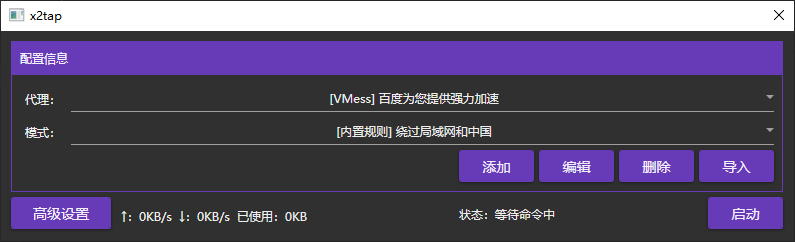
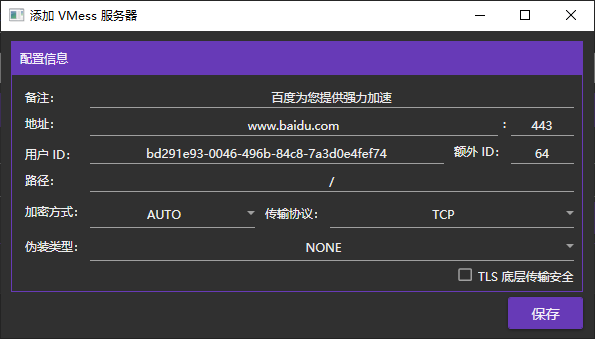

# x2tap
一个基于 tun2socks 的 VPN 工具，支持 v2ray 和 Shadowsocks 代理。类似于 SSTap

**仍在开发中**

# 截图（预览图，不一定是最终的效果）

# 用法
1. 从 [releases](https://github.com/hacking001/x2tap/releases) 下载最新的版本
2. 将其解压到一个文件夹下（路径最好不要有中文）
3. 打开其中的 `TAP-Windows.exe`，一路点击 `Next` 和 `Yes` 以完成 TUN/TAP 驱动安装
4. 打开 `x2tap.exe` 即可开始玩耍